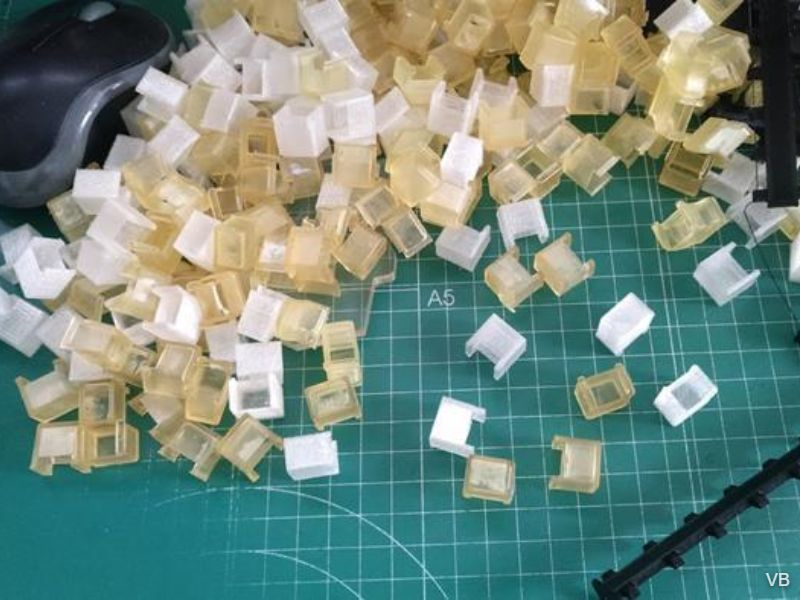
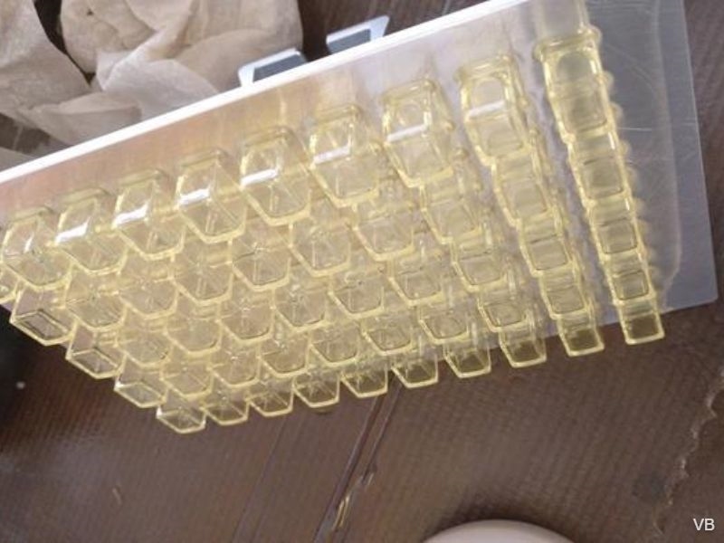
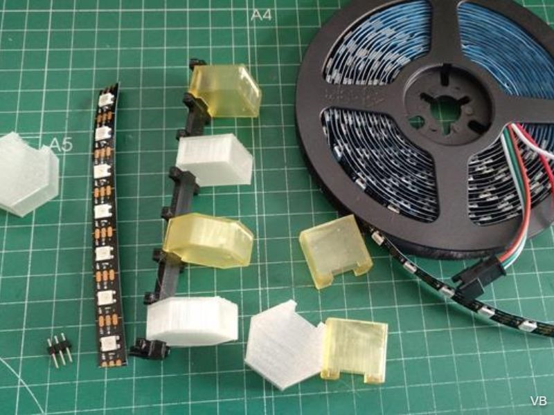
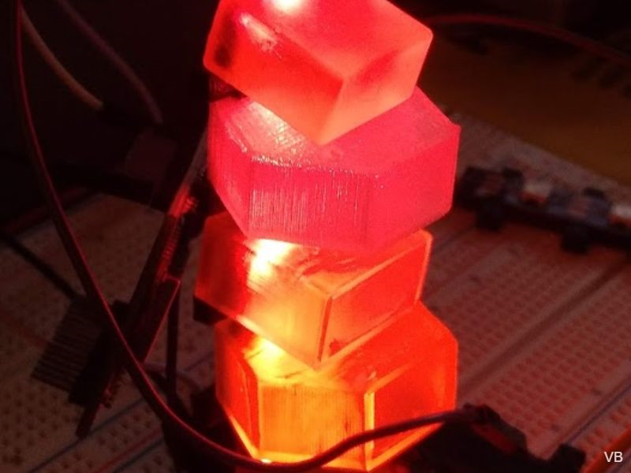
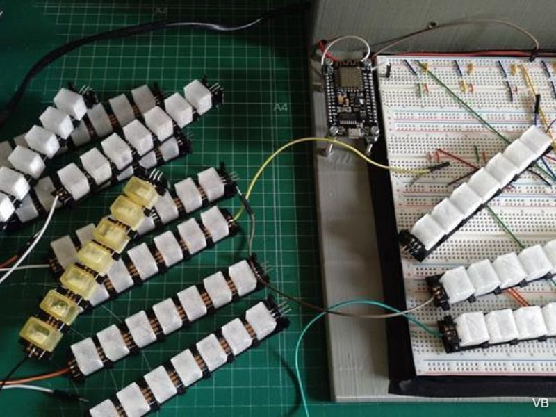
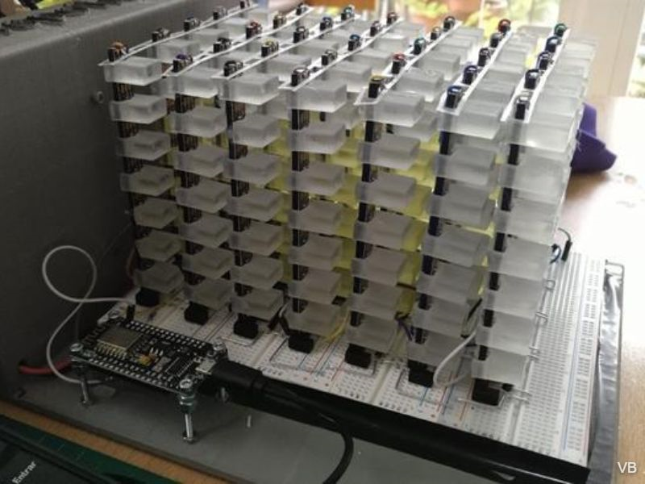

## Versión prototipo

#### **Prototipo** finalizado en verano 2021. 
 
5x7x7 vóxeles (245 LED totales). Construido sobre protoboards para facilitar el ensamblado y pruebas. Modelo usado como muestra en la campaña de crowdfunding. ESP8266 y firmware FASTLED modificado.

**Este equipo tuvo un uso efímero** y se utilizó en la campaña de captación de fondos del crowdfunding. Tras varios viajes quedo bastante maltrecho **asi que actualmente está desmontado.** Preveo reutilizar algunas de sus piezas para hacer un modelo pequeño y mas robusto, pero si deseas hacer uno vete directamente a la versión 2 que tienes [**aquí:**](/"V2 FINAL"/README.md)

Adjunto algunas fotos del proceso de montaje así como algunas características:

- Creación de diversos tipos de difusores:

- Difusores impresos en resina:

- Pruebas con diversos tipo de difusores:

- Prueba de encendido de difusores para apreciar el efecto:

- Ensamblado del prototipo en las protoboard:

- Equipo montado, aspecto final:

- Como vemos en las fotos, el ESP82266 está al lado izquierdo, unido a una pieza de chasis que aloja en su parte posterior una fuente de alimentación de 5V.
- Delante tenemos las protoboard, con interconexiones hechas mediante alambre de acero doblado a medida con pinzas. 
- Cada barra LED tiene 7 LED y se inserta individualmente en las protoboard. Todas las barras LED tienen conexion a 5V y GN, mas una entrada de datos Din y una salida Dout de tal forma qu están conectados en cascada. 
- El primer Din se conecta a la pata D4 en el ESP8266 con una resistencia limitadora de 470ohm (El cable blanco que se ve en la foto). 
- El ESP8266 debe estar conectado a la misma GND que el resto del equipo. 
- Como este modelo era el prototipo y estaba casi constantemente conectado al ordenador para reinstalar nuevo firmware se alimenta directamente desde el puerto microusb que vemos al frente.

