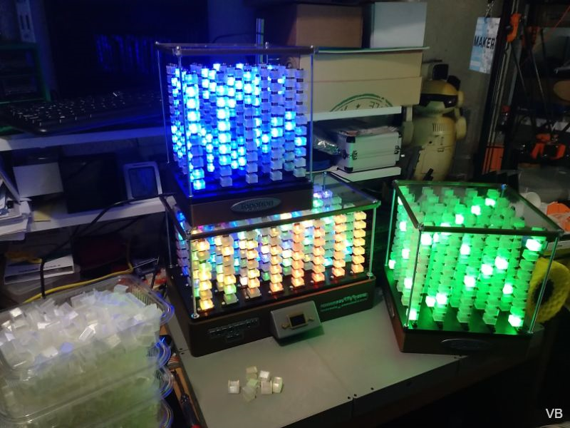
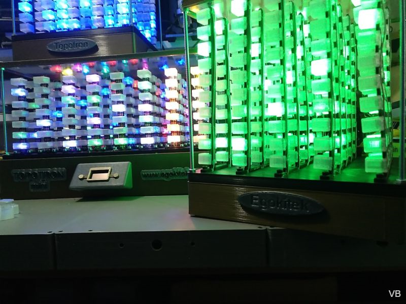
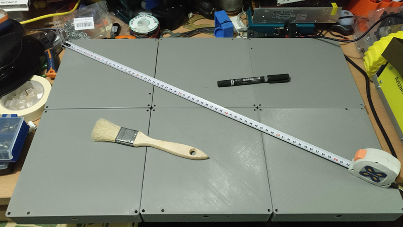

# TopoTron

## Un display volumétrico de baja resolución 

### Concepto

**TopoTron** es un display volumétrico que utiliza LEDs direccionables **2812** para crear una matriz tridimensional. En este proyecto se exploran las posibilidades y capacidades que un dispositivo de este tipo ofrece para crear no solo topografías sino efectos visuales, animaciones etc.

Se asemeja en concepto a los conocidos **cubos LED**, pero en este caso el factor de forma es diferente, es un prisma de poca altura y bastante base. De este modo se pueden mostrar topografías mas fácilmente. También se presta atención a los difusores de luz de los LED . En un cubo LED normalmente no se emplean por lo que vemos una matriz de puntos luminosos que pueden crear efectos visuales pero no dan una buena sensación de volumen. En Topotron los difusores buscan un compromiso entre recrear un volumen y no entorpecer visualmente los LED que se encienden al frente con los que se encienden por detrás. Asi que el tipo de material del difusor, su tamaño y forma, y la distancia entre los mismos influyen en el efecto a conseguir.

En esta imagen de concepto vemos el objetivo ideal. Se ha realizado mediante el programa opensource **MagicaVoxel.**

### Características de los modelos y versiones:

- **Prototipo** desarrollado en verano 2021. **5x7x7 vóxeles** (245 LED totales). Construido sobre protoboards para facilitar el ensamblado y pruebas. Modelo usado como muestra en la campaña de crowdfunding. ESP8266 y firmware FASTLED modificado.

- **Versión 1 o mediana**. Desarrollado en primavera de 2022. **8x5x7 vóxeles** (280 LED totales). Completamente impreso en 3D con cableado y ensamblado interno. Procesador ESP8266 y firmware FastLED modificado.

- **Versión 2 o pequeña**. Desarrollado en verano de 2022. **5x5x10 vóxeles** (250 LED totales). Completamente impreso en 3D con cableado y ensamblado interno. Procesador ESP8266 y firmware WLED modificado. Versión modular que se puede ensamblar en unidades mayores.

La versión que se entregará como recompensa es la 2, que es por el momento la versión final y puede servir para crear modelos de tamaños diversos. Los vemos a continuación:

### Modelo grande (objetivo del proyecto): 

- **Versión L** en construcción, finalización en diciembre de 2022. Matriz mas grande con 15x10x10 vóxeles (1500 LED totales) o similar. Formada por 6 modelos V2 unidos entre si. Procesador ESP32 y firmware WLED modificado.

### Lista de materiales (BOM):

El enlace está **[aquí](BOM.xlsx)** (en construcción):

### Crowdfunding y cofinanciadores:

Este proyecto se inicio como concepto y se prototipó en el marco del concurso internacional **Hackaday Prize** realizado en 2021. El enlace a ese proyecto (en inglés) está **[aquí](https://hackaday.io/project/180204-topotron).**

Se presentó a concurso y no quedó seleccionado, pero la idea me gustó y quise seguir trabajando con ella, con el fin de construir una unidad mas grande y ver así las posibilidades que ofrecía. Por ello me presenté a crowdfunding con la **Fundación Goteo** y a final de 2021 conseguí los fondos necesarios. 

Asi que este proyecto no hubiera sido posible sin el apoyo de las personas y colectivos que lo han cofinanciado. 

La ficha del proyecto en la **Plataforma Goteo** la tienes **[aquí](https://www.goteo.org/project/topotron).**

La lista de personas y colectivos que han contribuido a la financiación la tienes **[aquí](Cofinanciadores.md).**

### Futuro del proyecto:

En septiembre de 2022 he entrado a la empresa **Camp Tecnológico** dedicada entre otras cosas a la formación y el ocio tecnológico. En ella ampliaremos el catálogo de productos y servicios ya existente, al que se añadirá este proyecto.

Es un proyecto opensource con licencia GPL3.0, asi que eres libre de utilizarlo como quieras. Pero le seguiré dando continuidad desde el seno de la empresa en la que estoy actualmente.

## Creditos

**TopoTron** es un concepto desarrollado por **Victor Barahona** en **[Egokitek](https://www.egokitek.com/)**.

Se ha inspirado en los **cubos LED** y otros conceptos de **display volumétricos**.

En este proyecto estoy utilizando las librerías **FASTLED y WLED** con modificaciones.

## Licencia

**GPL3.0**

## Video demostrativo y mas imágenes:

Tienes mas imágenes en la carpeta de [**Galería.**](/Galeria)

En este video teneis una muestra del desarrollo. Forma parte de una lista con varios videos mas. Os invito a ver el resto de contenidos. **[Topotron: desarrollo del proyecto](https://youtu.be/e-akGpGEZ80)**.

Renderizados hechos con **MagicaVoxel**

