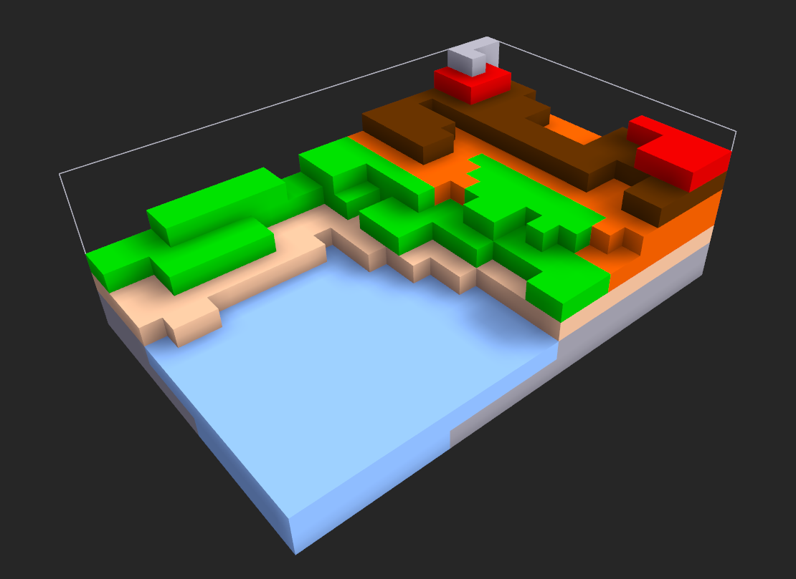
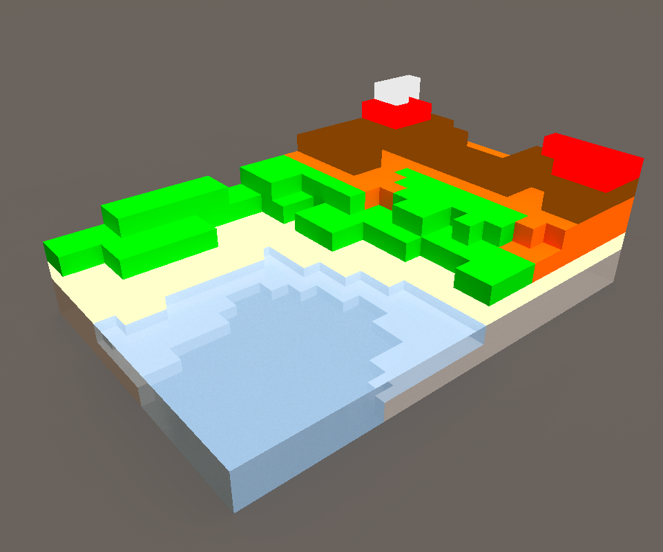

# TopoTron

## A volumetric display intended to use in topography

## Concept

**TopoTron** is a simple volumetric display that uses adressable LEDs as WS2812 to create a tridimensional matrix. In this project I explore the posibilities and capabilities with a low resolution matrix to create not only topographies, also other beautiful effects.

Render made with **MagicaVoxel**

## Main Features

- First prototype with 5x8x7 voxels.
- WS2812 LED strips.
- 3D printed diffusers to create a better effect.
- MCU based in ESP8266.

In a future version I will work in a much better prototype with

- Bigger matrix with 16x16x7 , 24x16x8 voxels or similar (to be defined).
- APA102 or other addresable LEDs with a better refresh rate.
- A well designed frame to fit the display.
- Processing software to create effects to be uploaded in ESP8266

## Bill of Materials (BOM):

This LibreOffice spreadsheet is a work in progress.

The link is **[here](BOM.xlsx)**:

## Credits

**TopoTron** is a concept developed by **Victor Barahona** in **[Egokitek](https://www.egokitek.com/)**.

I have been inspired by **LED cubes** and other volumetric displays.

In this project I'm using FASTLED Libraries and my own content. See more in **[FastLED](https://github.com/FastLED/FastLED)**

## License

**GPL3.0**

Render made with **MagicaVoxel**

