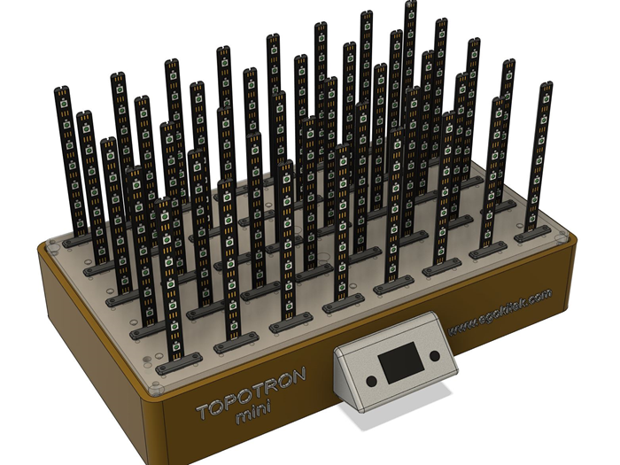
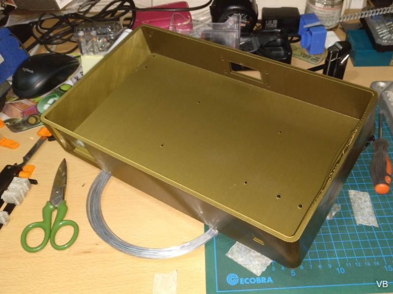
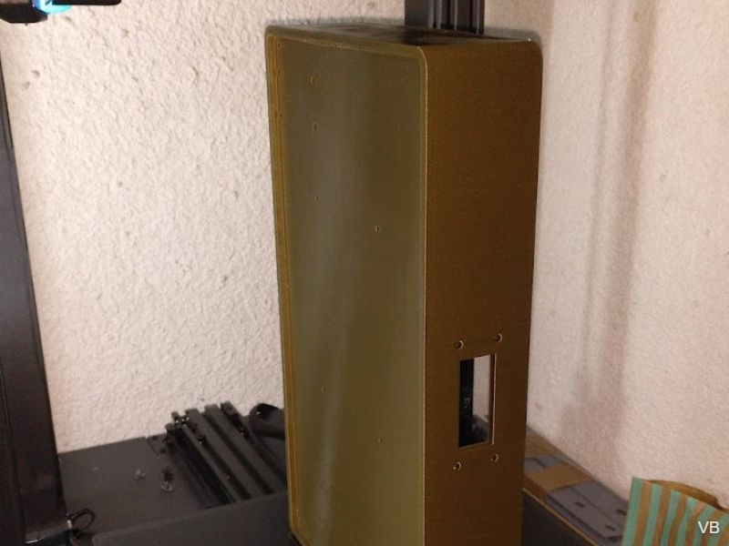
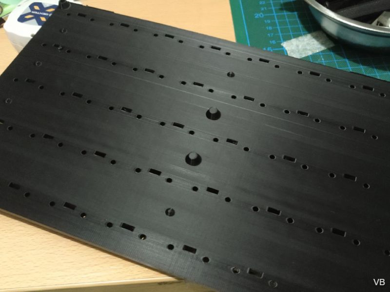
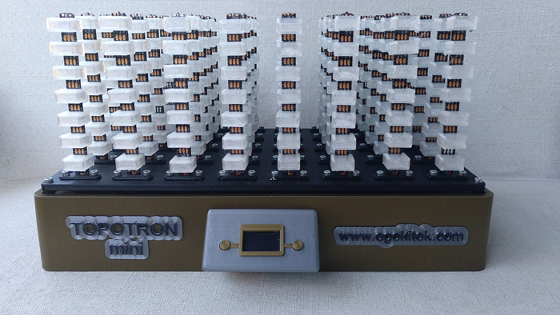

## Versión 1 (M)

#### **Versión M** finalizada en primavera 2022. 
 
Matriz con 8x5x7 vóxeles (280 LED totales). Completamente impreso en 3D con cableado y ensamblado interno. Procesador ESP8266 y firmware FastLED modificado.

Inicialmente quería incluir un interfaz básico con display oled de 0,96 pulgadas y dos pulsadores. Llegó a estar operativo, pero al tiempo que lo terminaba encontré un proyecto que permitía manejar por wifi , se llama **WLED** y es el que finalmente he desplegado en todos los equipos. Reúne casi todos los requisitos que buscaba y con un excelente interfaz que puedes manejar desde movil, tableta u ordenador. 

**Este equipo** tiene un ancho de unos 32cm, lo que **requiere una impresora grande**. En mi caso utilicé una **Artillery X1**. El tema del tamaño me llevó a rediseñar el proyecto para que fuera modular y mas facil de imprimir. Por eso mismo no me detengo en su proceso constructivo, sino que adjunto algunas fotos. Si quieres hacer uno te recomiendo que vayas directamente a la versión dos que tienes [**aquí.**](/V2%20FINAL/README.md)

- En primer lugar, un renderizado hecho con **Fusion360:**

- La base se imprimió en color dorado ya que quería dar a este equipo un toque **steampunk:**

- Otra foto recién salida de la impresora, para apreciar la dificultad añadida por el tamaño y la cuestión de los soportes: en una pieza como esta añadiría mucho tiempo de impresión y material de soporte sobrante. Tomé el riesgo y pude imprimirla sin ellos.

- Aquí vemos el aspecto de la placa donde se montarán las barras LED y sus agujeros pasantes:

- Y aquí el resultado final, a falta de la tapa superior en metacrilato. Mas fotos en la [**Galería**](/Galeria/README.md):

