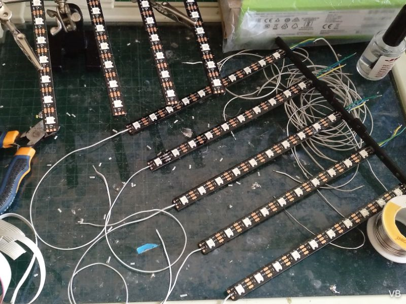
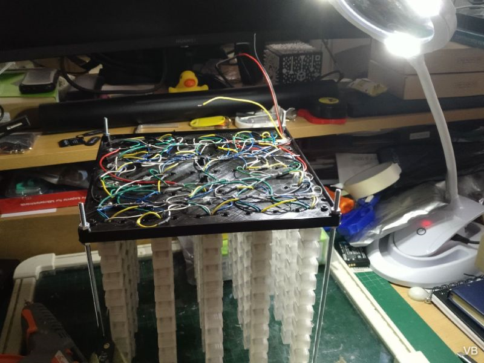

## Versión 2

### **Versión 2** (final) terminada en verano de 2022. 
 
Matriz con 5x5x10 vóxeles (250 LED totales). Completamente impresa en 3D con cableado y ensamblado interno. Procesador ESP8266 y firmware WLED modificado. Versión modular que se puede ensamblar en unidades mayores.

**Este es el aspecto del renderizado previo (realizado en Fusion360):**

**La unidad terminada se ve así.** En este caso está dada la vuelta, es algo posible debido a la placa superior protectora en metacrilato unida mediante barras roscadas de métrica 4.

**Encendida se ve de esta manera:**

**Curiosamente basta con alimentar con una fuente USB de móviles al microcontrolador.** Este puede suministrar suficiente corriente para que los LED funcionen tal y como se ve en las fotos. Esto se debe a que el microcontrolador ESP8266 tiene una pataVin que puede servir de salida de la tension entrante por su puerto miniusb. Se limita por software la corriente máxima de salida a unos 500mA. Hay quien dice que se puede sacar hasta 1A o 1000mA) pero por precaución lo dejo en 500. No me han dado ningun problema los diferentes modelos que he construido hasta ahora para las recompensas.

### ¿Cómo se construye?

- Imprimimos 5 piezas de "Barra LED 5x10" , preferentemente en color negro, y sobre ellas pegamos tiras LED con una longitud de 10 LED. Antes de pegarlas les soldamos previamente un cable rojo para 5V, otro negro para GND y otro de cualquier color para Din (data input). todos estos cables han de tener una longitud de unos 3cm en 3 de las piezas. En una el de 5V será mas largo, de unos 8cm. Y en otra el GND tendrá 8cm. Esto se debe a las necesidades de conexionado posterior. Despues de soldar estos cables podemos pasarlos por un agujero en el soporte de "Barra LED 5x10", hay uno por cada tira. Y despues podemos pegarlas.

- Despues soldamos en la parte superior de cada tira, en su pin Dout, un cable largo de unos 20cm. En mi caso he empleado hilos de un antiguo bus IDE de ordenador, ya que son finos, flexibles y perfectamente válidos para esta tarea. Pero vale cualquier otro. Es conveniente que sea oscuro para que no destaque mucho sobre la pieza que es negra, ya que irá pegado en su parte posterior.

- Después podemos pegar una a una todos los difusores sobre cada uno de los LED. Son 250 piezas de "celda QUAD v3". Las imprimimos en lotes de 25, 50 o como podamos, en PLA transparente o resina. En el caso de PLA con 3 perímetros y top/bottom de 3. Para pegarlas  el cianocrilato es una opción pero a mi me ha dado bastantes problemas. Recomiendo cola termofusible para esta tarea:

- Después de terminar las 5 piezas soporte de LED podemos unirlas a la pieza "Base tiras LED 5x5" (de esta sólo se imprime una). Los que tienen los colores rojo y negro de la misma longitud (sobre 3cm) están en las 3 posiciones centrales de la base. Mientras que los que tienen cable rojo (o negro) de unos 8cm se colocan en los extremos de la base. Primero debemos pasar el cableado (4 hilos por cada barra LED) a través del agujero correspondiente en la base, y cuando pasamos todos los hilos de las 5 barras de esa pieza se puede unir a la base con dos tornillos m3x10 a ambos lados, con la tuerca por la parte inferior. Apretamos bien y de ese modo todas las barras LED quedarán paralelas y verticales. Bien alineadas. Tenemos mas agujeros pasantes por si queremos poner mas tornillos m3x10 y reforzar la unión. Preferentemente usamos tornillos negros.

- Tras unir todas las piezas, si damos la vuelta al conjunto lo veremos de esta manera, con todos los cables pendientes de soldar. Atención, en la foto no se ven de color negro y rojo, solo es una recomendación para no confundirse, pero pueden emplearse otros colores como en este caso.

- Cortamos 4 alambres de acero de aprox 1mm de diametro y 19cm de largo. Los pegamos con cinta de carrocero a la base, sobre unos pequeños promontorios en la pieza (hay 3 por cada alambre). Esto permitira hacer las soldaduras reduciendo el contacto directo con la pieza de PLA, que se puede dañar. Estos alambres serán 5V, GND, 5V, GND, en ese orden, de tal modo que todas las barras tendrán cerca alambres a los que ser soldados.

- Soldamos por tanto los cables rojos y negros a sus correspondiente alambres de 5V y GND. Los que tienen los colores rojo y negro de la misma longitud (sobre 3cm) están en las 3 posiciones centrales de la base. Mientras que los que tienen cable rojo (o negro) de unos 8cm se colocan en los extremos de la base, de tal forma que el cable largo va al alambre correspondiente que le queda a mayor distancia. Cuando terminemos de soldar todo podemos pegar los alambres con cola termofusible a los promontorios y retiramos la cinta de carrocero.

- Una vez de hecho lo anterior debemos unir cada cable Dout de una barra al cable Din de la siguiente, para que esten conectados en serie. El primer Din está libre porque es el que conectaremos al microcontrolador. El ultimo quedará sin conectar. Si miramos el conjunto de frente desde la parte superior empezaremos por la fila del fondo empezando a la izquierda. El primer Din a la izquierda es el que val controlador. De ahi conectamos su Dout a la Din de la siguiente columna LED, y asi sucesivamente a la derecha. Cuando llegamos a la ultima barra conectamos a la ultima en la derecha en la fila precedente, que es la que le queda contigua. Y en esa fila precedente conectamos de derecha a izquierda. La siguiente fila (la central) vamos de izquierda a derecha), la siguiente a izquierdas y por fin la quinta y ultima fila, la que está al frente a derechas. Esto es un poco lioso, lo ideal sería una foto o gráfico pero he sacado varias y no se aprecia bien. Adjunto una foto por si resulta aclaratorio. **IMPORTANTE: Poner un trozo de termoretractil a cada unión de datos para evitar cortocircuitos o comportamientos indeseados.**

- Conectamos los dos alambres de 5V y los dos de GND entre si con un trozo de cable de suficiente sección.

- Conectamos un cable rojo a 5V y otro a GND, de suficiente sección, y de unos 15cm de longitud. De tal forma que esten alineados para poder salir por un agujero pasante a través de la pieza "base ppal" (ver mas adelante).

- **Conectamos el cable de Din de la primera barra LED a una resistencia de unos 470ohm** y despues a un cable de unos 15cm, este conectará al microcontrolador. Puede ponerse la resistencia al otro extremo, en el lado del MC. Este cable pasará también por el agujero pasante con los dos de 5V y GND.

- Hacemos una prueba de encendido (ver [**aquí**](/SW%20y%20configuración/README.md)) para asegurarnos de que todo funciona. Si es así, adelante al siguiente paso. Si no, toca revisar y reparar la/s soldaduras defectuosas, que es habitualmente la fuente de problemas.

- Si todo está bien podemos acomodar los cables para que abulten lo menos posible, incluso pegando en algunos puntos con cola termofusible. Quedará como en la foto.

- El controlador se coloca en la pieza "base ppal", sobre un espacio habilitado para ello, de tal forma que puerto micro usb quede apuntando el exterior por un egujero a medida. Le colocamos tornillos de m3x10 con tuerca a los agujeros al efecto en "base ppal". Puede que no entren los 4, pero basta con que entren dos en diagonal para que quede firmemente sujeto. El cableado se ha probado previamente en la prueba de encendido.

- Colocamos la "base de tiras led" en la pieza "base ppal" . Veremos 4 agujeros en las esquinas, son de métrica 4. Pasaremos 4 varillas roscadas de M4 y unos 25cm de largo c/u, a traves de la base de tiras led y la base ppal. Fijaremos ambas piezas con tuerca y contratuerca, de tal forma que por abajo sobresalga de la base ppal unos 2-3mm y queden base ppal y "base de tiras led" unidas. Debe haber una holgura de 1mm entre ambas. Es normal porque los promontorios de "base tiras led" están diseñado de esa manera. Es para que haya suficiente espacio para el cableado que se ha soldado.

- Conectamos Vin, GND y Din al cableado que llega desde la "base de tiras led" y fijamos este cableado para que no se mueva.

- Colocamos la pieza "tapa inferior", encaja a medida en las 4 varillas m4 y podemos unirla a la base. Cerramos con tuerca o mejor aun con tuerca autoblocante (nyloc).

- Pegamos con termofusible "Rotulo Topotron V2" en el frontal, "Rótulo Egokitek V2" en el lateral derecho y "Tapa decorativa" en la parte trasera. El lateral izquierdo se deja libre ya que es el punto de acceso al puerto microusb del microcontrolador.

- Cortamos una pieza de metacrilato de 20x20cm y la presentamos sobre las varillas roscadas. Marcamos los puntos y taladramos. La insertamos, de tal manera que tenemos tuerca y contratuerca para sujetarla. La tuerca superior puede ser una nyloc para evitar que se afloje con el tiempo.

- Por último pegamos en las aristas la pieza "arista 16cm", debemos sacar 4 copias. Estos es opcional pero sirve para cubrir la arista que puede ser afilada o tener un corte irregular. En la foto podemos ver el aspecto final que tiene. 
 
  ### A partir de ahora toca usar el equipo. 
  
  Para ello ve [**aquí**](/SW%20y%20configuración/README.md)

**Si quieres ver fotos del equipo encendido las tienes en la**  [**Galería:**](/Galería)

