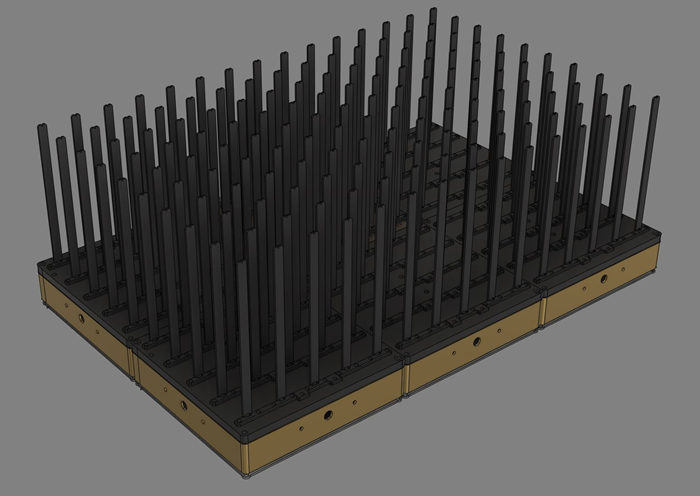
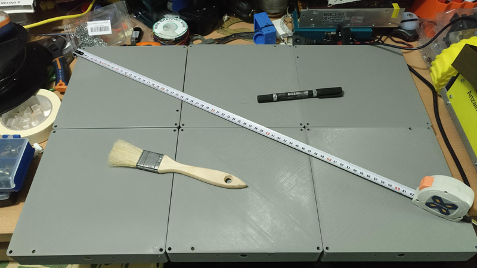
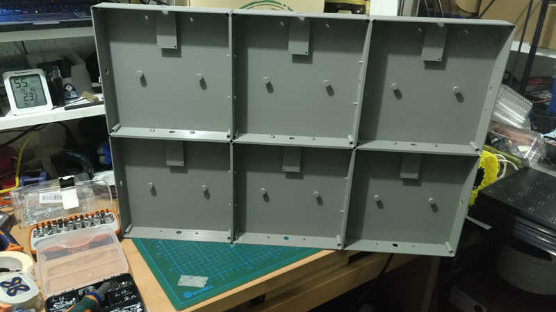

## Versión grande. 6 módulos V2 unidos

#### **Versión L** en construcción, finalización en diciembre 2022. 
 
Matriz mas grande con 15x10x10 vóxeles (1500 LED totales) o similar. Formada por 6 modelos V2 unidos entre si. Procesador ESP32 y firmware WLED modificado. Los datos se transmiten a través de 3 pines y no de uno, esto facilita la velocidad de refresco y gestión de los datos.

Renderizado hecho con **Fusion360**.

Los 6 módulos de 20x20 unidos forman una pieza de 60x40cm que presenta el siguiente aspecto:

Por debajo la base se ve de esta manera. Contiene agujeros pasantes para union entre bloques y paso de cableado. Mas un punto donde colocar el MCU con salida de su puerto microUSB al exterior.

Mas imágenes en la carpeta de [Imágenes](/Imagenes)
